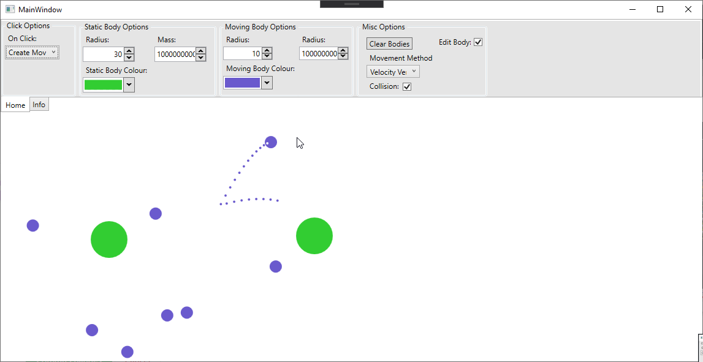

# Particle-Simulation
A WPF application that simulates gravity between bodies

## Features
- Multiple ways of implemeting motion:
  - Euler method
  - Velocity Verlet
- Static and moving bodies
- Collision
- Trajectory

